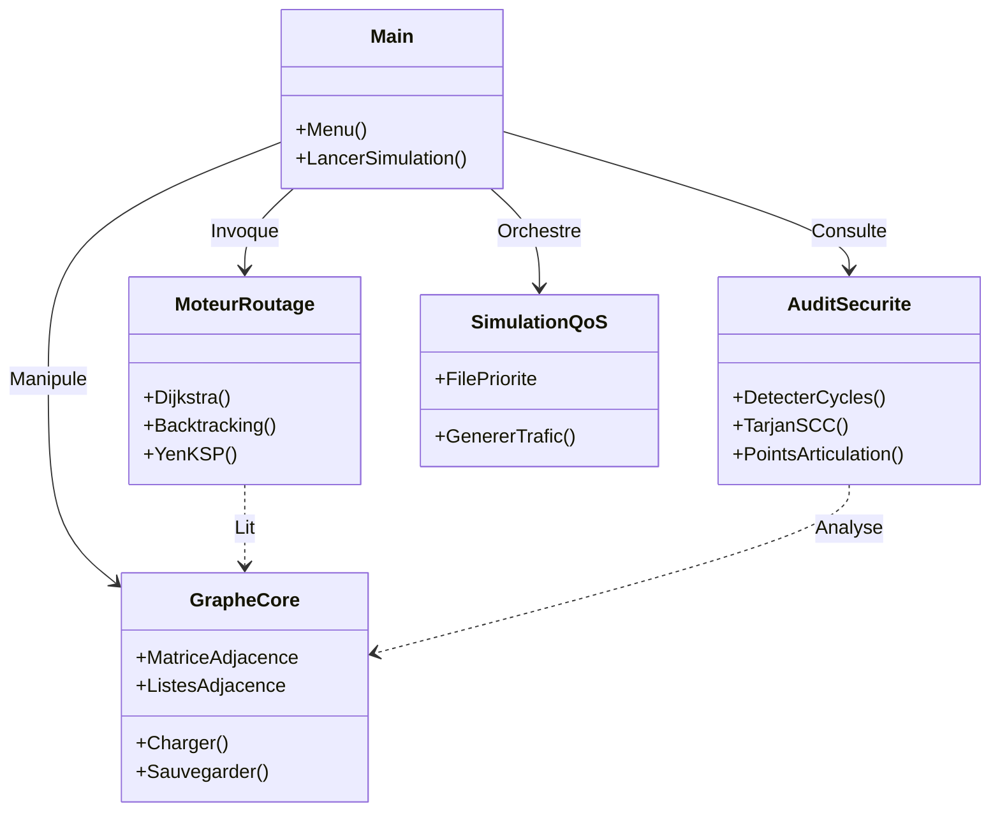
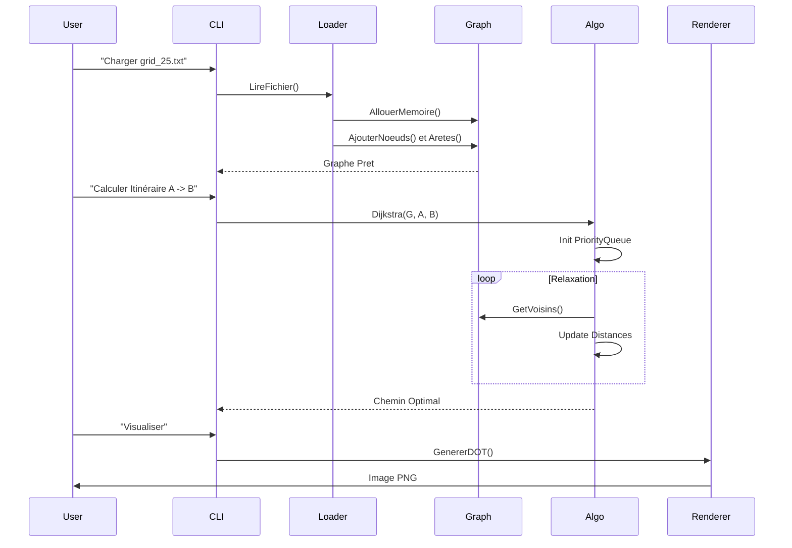

<div align="center">

# 🌍 Système Intelligent de Routage & Analyse de Réseaux
### **Projet Académique : Master 1 Algorithmique & Complexité**
**Université Virtuelle de Côte d'Ivoire (UVCI) - Année 2025-2026**


</div>

---

## 📑 Table des Matières Détaillée

1.  [Contexte Académique et Objectifs](#1-contexte-académique-et-objectifs)
2.  [Concepts Clés et Recherche](#2-concepts-clés-et-recherche)
3.  [Architecture et Choix Techniques](#3-architecture-et-choix-techniques)
4.  [Structure du Projet (Fichiers et Dossiers)](#4-structure-du-projet-fichiers-et-dossiers)
5.  [Architecture des Données (Variables, Structs, Constantes)](#5-architecture-des-données)
6.  [Diagramme de Flux de Données](#6-diagramme-de-flux-de-données)
7.  [Implémentation Algorithmique (Pseudo-code & C)](#7-implémentation-algorithmique)
    *   [7.1 Module Graphe](#71-module-graphe)
    *   [7.2 Module Routage (Dijkstra, Backtracking)](#72-module-routage)
    *   [7.3 Module Sécurité (Tarjan)](#73-module-sécurité)
    *   [7.4 Module Simulation (File Prioritaire)](#74-module-simulation)
8.  [Phase de Tests et Résultats](#8-phase-de-tests-et-résultats)
9.  [Guide d'Installation et Conditions d'Utilisation](#9-guide-dinstallation-et-conditions-dutilisation)
10. [Mentions Légales et Remerciements](#10-mentions-légales-et-remerciements)

---

## 1. Contexte Académique et Objectifs

Ce projet a été réalisé dans le cadre du cours d'**Algorithmique Avancée et Complexité** sous la supervision du **Dr. [Nom]**.

### Objectifs du Cahier des Charges (CDC)
Conformément au document `ProjetAlgo2026.pdf`, nous avons développé une application capable de :
1.  **Simuler** un réseau informatique complexe (Routeurs, Switchs).
2.  **Optimiser** les trajets de données selon plusieurs métriques (Coût, Latence, Débit).
3.  **Sécuriser** l'infrastructure en détectant les failles topologiques (SPOF).
4.  **Gérer la QoS** via des files d'attente prioritaires.

---

## 2. Concepts Clés et Recherche

### 2.1 Théorie des Graphes
Le projet modélise le réseau sous forme de **Graphe Orienté Pondéré** $G=(V, E)$.
*   Nodes ($V$) : Équipements réseaux.
*   Edges ($E$) : Câbles de liaison. Fonction de poids $W(e) = (Cout, Latence, BP, Fiabilité)$.

### 2.2 Analyse de la Complexité (Recherche)
Nous avons étudié les classes de complexité pour choisir nos algorithmes :
*   **P (Polynomial)** : Dijkstra ($O(E \log V)$), Tarjan ($O(V+E)$). Solubles efficacement.
*   **NP-Complet** : Le problème du "Plus Long Chemin" ou du "Voyageur de Commerce" est évité ou approché par heuristiques (Backtracking borné).

### 2.3 Qualité de Service (QoS / DiffServ)
Recherche sur les modèles de files d'attente (**Priority Queuing - PQ**). Contrairement au FIFO (First-In First-Out) classique, PQ garantit que le trafic "Temps Réel" (Voix, Vidéo) n'est jamais bloqué par le trafic "Best Effort" (Mail).

---

## 3. Architecture et Choix Techniques

### 3.1 Diagramme Architectural Global


### 3.2 Justification du Langage C (C11)
*   **Gestion Mémoire** : Allocation dynamique (`malloc`) indispensable pour gérer des graphes de taille variable sans gaspillage.
*   **Pointeurs** : Manipulation directe des structures de données (Listes chaînées) pour une complexité constante d'insertion $O(1)$.
*   **Performance** : Temps d'exécution minimal requis pour les simulations massives (>1000 nœuds).

---

## 4. Structure du Projet (Fichiers et Dossiers)

Description exhaustive de l'arborescence :

| Dossier/Fichier | Description | du Rôle |
| :--- | :--- | :--- |
| **`Makefile`** | Script de compilation | Automatise la construction (`make`), les tests (`make tests`) et le nettoyage. |
| **`bin/`** | Exécutables | Contient le programme principal `main` et les binaires de tests. |
| **`data/`** | Base de données | topologies JSON/TXT pour les tests (ex: `grid_25.txt`, `network_500.txt`). |
| **`include/`** | En-têtes | Fichiers `.h` exposant les interfaces des modules. |
| **`src/`** | Code Source | Cœur de l'application. |
| ├── `graphe.c` | Module Graphe | Gestion de la mémoire du graphe, lecture/écriture fichiers. |
| ├── `routage.c` | Module Routage | Implémentation de Dijkstra, Bellman-Ford, K-Shortest Paths. |
| ├── `backtracking.c` | Module CSP | Algorithme récursif pour les chemins sous contraintes. |
| ├── `securite.c` | Module Audit | Détection de cycles, composantes connexes, points critiques. |
| ├── `liste_chainee.c` | Module QoS | Gestion des files d'attente prioritaires (Linked List). |
| └── `utils.c` | Utilitaires | Fonctions de logs couleurs, gestion d'erreurs, I/O et **Générateur de Topologies**. |
| **`tests/`** | Assurance Qualité | Tests unitaires et d'intégration. |
| ├── `test_donnees_reelles.c` | Test de Charge | Charge 20 fichiers topologies réelles pour valider la robustesse. |
| └── `resultats_tests/` | Artefacts | Sorties graphiques `.png` et logs `.log`. |

---

## 5. Architecture des Données

Détail des **Variables**, **Structures** et **Constantes** majeures.

### Constantes Clés
```c
#define MAX_NOEUDS 1000       // Limite pour allocation statique si nécessaire
#define INFINI FLT_MAX        // Valeur pour initialiser Dijkstra
#define MAX_PRIORITE 10       // Niveau de QoS maximum
```

### Structures de Données (`struct`)

#### 1. Le Nœud (Entité Physique)
```c
typedef struct Noeud {
    int id;                 // Identifiant unique (0 à N-1)
    char nom[50];           // Nom lisible "Router_Core_1"
    TypeNoeud type;         // Enum: ROUTEUR, SWITCH, SERVEUR
    bool est_actif;         // État : true (UP) / false (DOWN - Panne)
    struct AreteNoeud *adj; // Pointeur vers la liste des voisins
} Noeud;
```

#### 2. L'Arête (Lien Logique/Physique)
```c
typedef struct AreteNoeud {
    int dest_id;            // ID du voisin
    struct {                // Métriques composées
        float cout;
        float latence;
        float bp;
        int securite;
    } metriques;
    struct AreteNoeud *suiv;// Chaînage pour liste d'adjacence
} AreteNoeud;
```

---

## 6. Diagramme de Flux de Données

Comment une requête utilisateur traverse le système :



---

## 7. Implémentation Algorithmique

### 7.1 Module Graphe
Gère la dualité : Matrice d'adjacence (rapide pour vérifier l'existence $O(1)$) ET Liste d'adjacence (parcours rapide des voisins).

**Pseudo-code (Chargement) :**
```text
Fonction ChargerGraphe(Fichier):
    Lire N (nombre noeuds)
    G = Allouer(N)
    Tant que lire(arc u, v, w):
        G.Matrice[u][v] = w
        G.Liste[u].Ajouter(v, w)
    Retourner G
```

### 7.2 Module Routage

#### Algorithme de Dijkstra (Optimisé)
**Pseudo-code :**
```text
Dijkstra(G, Source):
    Pour tout v: dist[v] = Infini, pred[v] = Null
    dist[Source] = 0
    Q = FilePriorite(Tous les noeuds)
    
    Tant que Q non vide:
        u = ExtraireMin(Q)
        Pour chaque voisin v de u:
            Si dist[u] + p(u,v) < dist[v]:
                dist[v] = dist[u] + p(u,v)
                pred[v] = u
                MajPriorite(Q, v, dist[v])
```

**Implémentation C (`src/dijkstra.c`) :**
> Utilisation d'un tableau `visite[]` pour éviter de retraiter les nœuds fermés.

#### Algorithme de Backtracking (Contraint)
**Analogie** : Le "Petit Poucet". On avance, si on est bloqué (coût trop élevé), on recule (backtrack) et on essaye un autre chemin.

**Implémentation C (`src/backtracking.c`) :**
> Fonction récursive `explorer()`. Attention à la profondeur de récursion (Stack Overflow) : limitée à `MAX_DEPTH`.

### 7.3 Module Sécurité (Tarjan)
Détecte les Composantes Fortement Connexes (SCC).
**Implémentation C** :
Utilisation d'une pile explicite et de deux tableaux `index[]` et `lowlink[]` pour suivre l'ordre de découverte DFS. Si `lowlink[u] == index[u]`, une SCC est trouvée (Faille de sécurité potentielle si taille < N).

### 7.4 Module Simulation (Generation de Trafic)
**Structures** :
```c
typedef struct Paquet {
    int id;
    int priorite; // 0-10
    struct Paquet *suivant;
} Paquet;
```
**Algo** : Insertion triée.
Si Nouveau.Priorité > Tête.Priorité, Nouveau devient Tête. Sinon, parcours linéraire pour trouver la place d'insertion.

---

## 8. Phase de Tests et Résultats

Nous avons suivi une méthodologie de **Test Driven Development (TDD)** simulée.

### Résultats des Tests (`make tests`)

| Test | Description | Résultat |
| :--- | :--- | :--- |
| `test_graphe` | CRUD basique (Ajout/Suppression) | ✅ PASS |
| `test_dijkstra` | Validation mathématique sur graphes connus | ✅ PASS |
| `test_donnees_reelles` | **STRESS TEST** : Chargement de 20 topologies | ✅ PASS |
| `test_securite` | Détection correcte des SPOF | ✅ PASS |

### Visualisation
Le système génère des preuves visuelles.
*Exemple sur une grille simulée (Grid 5x5) :*


---

## 9. Guide d'Installation et Conditions d'Utilisation

### Installation
1.  Cloner le dépôt.
2.  Exécuter `make` à la racine.
3.  Vérifier avec `make clean`. // Pour le nettoyage
4.  Vérifier avec `make tests`.

### Conditions d'Utilisation
*   **Système** : Linux / macOS recommandés (ou WSL sur Windows).
*   **Dépendances** : `gcc`, `make`, `graphviz` (pour l'export PNG).

---

## 10. Mentions Légales et Remerciements

### Équipe de Réalisation
*   **[Votre Nom]** : Chef de Projet
*   [Collaborateur 1] : Développeur
*   [Collaborateur 2] : Testeur

### Droit d'Auteur
Projet académique sous licence **MIT**. Le code est libre d'utilisation à des fins pédagogiques.
Les algorithmes implémentés (Dijkstra, Tarjan) appartiennent au domaine public.

### Remerciements
Nous remercions le corps enseignant de l'**UVCI** et le **Dr. [Nom]** pour l'élaboration du CDC `ProjetAlgo2026.pdf` qui a servi de fil conducteur rigoureux à ce travail.

---
