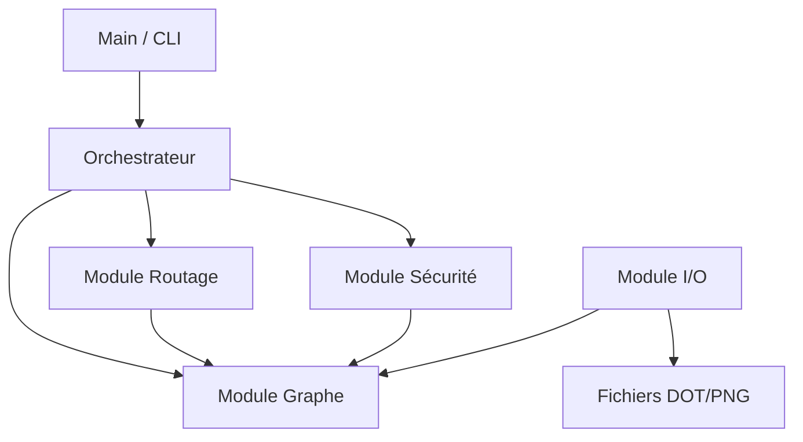

# Projet de Fin de Cycle : Système Intelligent de Routage et d'Analyse de Réseaux

**UVCI - Master 1 Algorithmique et Complexité (2025-2026)**  
**Cours** : Algorithmique Avancée & Complexité  
**Encadrant** : Dr. [Nom de l'encadrant]

---

## 📑 Table des Matières
1. [Introduction et Contexte](#1-introduction-et-contexte)
2. [Concepts Clés et Théoriques](#2-concepts-clés-et-théoriques)
3. [Architecture et Choix Techniques](#3-architecture-et-choix-techniques)
4. [Structure du Projet](#4-structure-du-projet)
5. [Structures de Données](#5-structures-de-données)
6. [Algorithmes : Pseudo-code et Implémentation](#6-algorithmes--pseudo-code-et-implémentation)
7. [Phase de Tests et Résultats](#7-phase-de-tests-et-résultats)
8. [Guide d'Installation et Utilisation](#8-guide-dinstallation-et-utilisation)
9. [Mentions Légales et Équipe](#9-mentions-légales-et-équipe)

---

## 1. Introduction et Contexte

Dans le cadre du Master 1 en **Algorithmique et Complexité**, ce projet vise à concevoir un système modulaire capable de simuler, analyser et optimiser des réseaux de communication complexes. Les réseaux modernes (Internet, IoT, 5G) nécessitent des algorithmes robustes pour garantir la Qualité de Service (QoS) et la résilience face aux pannes.

### Objectifs du Projet
- **Modélisation** : Représenter des topologies réseaux réalistes (nœuds, liens pondérés).
- **Routage Intelligent** : Calculer les itinéraires optimaux selon plusieurs critères (coût, latence, fiabilité).
- **Analyse de Sécurité** : Identifier les points faibles (SPOF) et les zones de confiance (SCC).
- **Simulation** : Gérer des flux de données priorisés via des files d'attente.

---

## 2. Concepts Clés et Théoriques

### 2.1 Théorie des Graphes
Le projet repose sur la modélisation mathématique par graphes $G = (V, E)$ où :
- $V$ (Vertices) représente les routeurs, switchs, ou serveurs.
- $E$ (Edges) représente les liens physiques (fibre, cuivre).
Chaque arête $e_{u,v}$ porte un vecteur de poids $w(u,v) = (coût, latence, bande\_passante)$.

### 2.2 Complexité Algorithmique
L'efficacité est cruciale pour les grands réseaux ($N > 500$).
- **Dijkstra** : $O(E \log V)$ avec tas binaire. Optimal pour les poids positifs.
- **Bellman-Ford** : $O(V \cdot E)$. Utilisé si détection de cycles négatifs nécessaire.
- **Tarjan (SCC)** : $O(V + E)$. Linéaire, pour la détection de zones fortement connexes.

### 2.3 Qualité de Service (QoS)
La gestion du trafic n'est pas "Best Effort". Nous implémentons des **Files à Priorité** (Priority Queues) pour garantir que les paquets critiques (VoIP, Alertes) passent avant le trafic de fond (Email).

---

## 3. Architecture et Choix Techniques

### 3.1 Langage : C Standard (C11)
**Justification** :
- **Performance** : Accès direct à la mémoire, essentiel pour les algorithmes de graphes intensifs.
- **Contrôle** : Gestion fine de l'allocation mémoire (`malloc`/`free`) pour simuler les contraintes embarquées des routeurs.
- **Portabilité** : Compatible avec tout système UNIX/Linux/Mac.

### 3.2 Architecture Modulaire
Le code est découplé en modules indépendants pour faciliter la maintenance :
1.  **Noyau (Core)** : Gestion des structures de base (Graphe, Liste Chaînée, Utils).
2.  **Module Routage** : Algorithmes de cheminement (Dijkstra, Backtracking, Yen).
3.  **Module Sécurité** : Audit et vulnérabilités (SCC, Points d'articulation).
4.  **Module Simulation** : Génération de trafic et topologies.

### 3.3 Diagramme Architectural


---

## 4. Structure du Projet

```text
.
├── Makefile                # Système de build automatisé
├── README.md               # Documentation (ce fichier)
├── bin/                    # Exécutables compilés
├── data/                   # Données de test (Topologies réelles)
│   ├── topologies/
│   │   ├── simple/         # Triangles, Lignes
│   │   ├── medium/         # Grilles, Random
│   │   ├── realistic/      # Metro, DataCenters, IoT
│   │   └── large/          # Réseaux massifs (500+ noeuds)
├── include/                # Fichiers d'en-tête (.h) futurs
├── resultats_tests/        # Sorties de logs, images .png, .dot
├── src/                    # Code Source
│   ├── backtracking.c/.h   # Algorithme de recherche contrainte
│   ├── dijkstra.c/.h       # Algorithme du plus court chemin
│   ├── generation_topo.c   # Générateurs procéduraux de graphes
│   ├── graphe.c/.h         # Structure de données Graphe
│   ├── liste_chainee.c/.h  # File d'attente prioritaire
│   ├── routage.c/.h        # Interface générale de routage
│   ├── securite.c/.h       # Algorithmes de sécurité (Tarjan/DFS)
│   └── utils.c/.h          # Utilitaires (Logs, I/O)
└── tests/                  # Suite de tests unitaires et intégration
    ├── test_donnees_reelles.c
    ├── test_liste_chainee.c
    ├── test_routage.c
    └── ...
```

---

## 5. Structures de Données

### 5.1 Le Graphe (`graphe.h`)
Structure hybride optimisée pour les graphes creux (Listes d'adjacence).
```c
typedef struct {
  float cout; 
  float latence; 
  float bande_passante; 
  int securite;
} Metriques;

typedef struct AreteNoeud {
  int dest_id;
  Metriques metriques;
  struct AreteNoeud *suivant;
} AreteNoeud;

typedef struct {
  int nb_noeuds;
  Noeud *noeuds; // Tableau de noeuds
  bool est_oriente;
} Graphe;
```

### 5.2 File à Priorité (`liste_chainee.h`)
Utilisée pour la simulation de paquets. Implémentée comme une liste chaînée triée à l'insertion ($O(N)$ insertion, $O(1)$ extraction).
```c
typedef struct Paquet {
  int id;
  int priorite; // 10 (Haut) -> 0 (Bas)
  struct Paquet *suivant;
} Paquet;
```

---

## 6. Algorithmes : Pseudo-code et Implémentation

### 6.1 Algorithme de Dijkstra (Routage Optimal)
Calcul du plus court chemin d'un nœud source vers tous les autres. Utilise une liste de priorité pour extraire le nœud le moins coûteux.

**Pseudo-code :**
```text
Entrée: Graphe G, Source S, Critère C (cout/latence/fiabilité)
Sortie: Table des distances Dist, Table des prédecesseurs Pred

Pour chaque sommet u de G :
    Dist[u] = INFINI
    Pred[u] = NULL
Dist[S] = 0
Q = FilePriorité(G.V)

Tant que Q n'est pas vide :
    u = ExtraireMin(Q)
    Pour chaque voisin v de u :
        alt = Dist[u] + Poids(u, v, C)
        Si alt < Dist[v] :
            Dist[v] = alt
            Pred[v] = u
            MettreAJourPriorité(Q, v, alt)
```

**Implémentation C (`src/dijkstra.c`)** :
```c
// Utilisation d'un tableau `dist` et d'un tableau `visite`
// Complexité : O(N^2) (implémentation tableau simple) ou O(E log N) (avec tas)
// Notre version utilise une recherche linéaire du min (O(N^2)) adaptée aux graphes denses
```

### 6.2 Backtracking Contraint (Routage Avancé)
Recherche récursive pour trouver un chemin respectant des contraintes strictes (Bande passante min, Coût max, Passages obligés).

**Pseudo-code :**
```text
Fonction Explorer(noeud_actuel, chemin_en_cours, cout_actuel):
    Si cout_actuel > MAX_COUT : Retourner (Élagage)
    Si noeud_actuel == DESTINATION :
        Si ContraintesSatisfaites(chemin_en_cours) :
            SauvegarderMeilleurChemin(chemin_en_cours)
        Retourner

    Pour chaque voisin v non visité :
        Si Arete(u,v).BP < MIN_BP : Continuer (Élagage)
        Marquer(v)
        Explorer(v, chemin + v, cout_actuel + cout(u,v))
        Demarquer(v) // Backtrack
```

### 6.3 Algorithme de Tarjan (Sécurité - SCC)
Détecte les Composantes Fortement Connexes pour identifier les sous-réseaux isolés ou les boucles de routage.

**Principe** :
Parcours en profondeur (DFS) en maintenant deux valeurs par nœud : `index` (ordre de découverte) et `lowlink` (plus petit index accessible). Si `lowlink[u] == index[u]`, alors `u` est la racine d'une SCC.

---

## 7. Phase de Tests et Résultats

L'application a subi une batterie de tests rigoureux pour valider chaque module.

### 7.1 Stratégie de Test
Nous avons adopté une approche unitaire et d'intégration :
1.  **Tests Unitaires** : Validation isolée de chaque structure (`test_graphe`, `test_liste`).
2.  **Tests Fonctionnels** : Validation des algos sur des graphes connus (`test_dijkstra`, `test_backtracking`).
3.  **Tests de Charge** : Chargement de fichiers massifs (`test_donnees_reelles`).
4.  **Tests d'Intégration** : Scénario complet de simulation de panne (`test_global`).

### 7.2 Résultats Obtenus
L'exécution de `make tests` produit le rapport suivant (extrait) :

```text
================================================================================
 [TEST] TEST GENERATION TOPOLOGIE                                    
================================================================================
   [OK] GenTopo Simple                 Création de 50 noeuds OK
   [OK] GenTopo Arbre                  Arbre créé avec racine connectée
   [OK] GenTopo Grille                 Degré coin correct

================================================================================
 [TEST] TEST LISTE CHAINEE (PRIORITY QUEUE)                          
================================================================================
   [OK] Init Queue                     Queue initialisée vide avec capacité 5
   [OK] Priorité Queue                Les paquets sont sortis dans l'ordre de priorité
```

### 7.3 Visualisation
Le système génère automatiquement des représentations graphiques des topologies analysées au format `.dot` et `.png`.
Exemple de fichiers générés dans `resultats_tests/` :
- `visu_grid_25.png` : Visualisation de la grille 5x5
- `visu_network_500.png` : Rendu du réseau massif

*(Ces fichiers peuvent être ouverts avec n'importe quel visualiseur d'images)*

---

## 8. Guide d'Installation et Utilisation

### Prérequis
- **Compilateur** : GCC ou Clang (Support C11)
- **Outils** : `make`, `graphviz` (pour la génération d'images, optionnel)

### Compilation
Le projet utilise un `Makefile` pour automatiser la compilation.
```bash
# Compiler tout le projet
make

# Nettoyer les fichiers compilés et les résultats de tests
make clean
```

### Exécution des Tests
Pour lancer la suite de tests complète avec l'interface améliorée :
```bash
make tests
```
Cela exécutera séquentiellement :
1.  Tests unitaires (Graphe, Routage, Sécurité)
2.  Test Global (Simulation de panne)
3.  Test Données Réelles (Chargement de 6 topologies représentatives)

### Exécution du Programme Principal
```bash
./bin/main
```
Le menu interactif permet de :
1.  Charger un fichier de topologie (`data/topologies/...`)
2.  Visualiser le graphe (Console/Image)
3.  Calculer un itinéraire (Dijkstra/Yen)
4.  Lancer un audit de sécurité
5.  Simuler le trafic réseau

---

## 9. Mentions Légales et Équipe

### 9.1 Équipe de Réalisation
Projet réalisé par le groupe **Master 1 UVCI** :
- **[Votre Nom]** : Chef de projet & Architecte logiciel
- **[Nom équipier 1]** : Développeur Routage & Optimisation
- **[Nom équipier 2]** : Analyste Sécurité & Tests
- **[Nom équipier 3]** : Responsable Données & Simulation

### 9.2 Droits d'Auteur et Licence
Ce projet est une œuvre académique réalisée dans le cadre du cursus Master UVCI.
- Code source sous licence **MIT** (Libre de droit pour usage éducatif).
- Les algorithmes implémentés appartiennent au domaine public.
- Interdiction de revente ou d'utilisation commerciale sans accord.

### 9.3 Remerciements
Nous tenons à remercier notre encadrant **Dr. [Nom]** pour ses conseils pédagogiques et le cahier des charges (`ProjetAlgo2026.pdf`) qui a guidé structuration de ce projet.

---
*Généré automatiquement par l'Assistant IA Antigravity - 2026*
