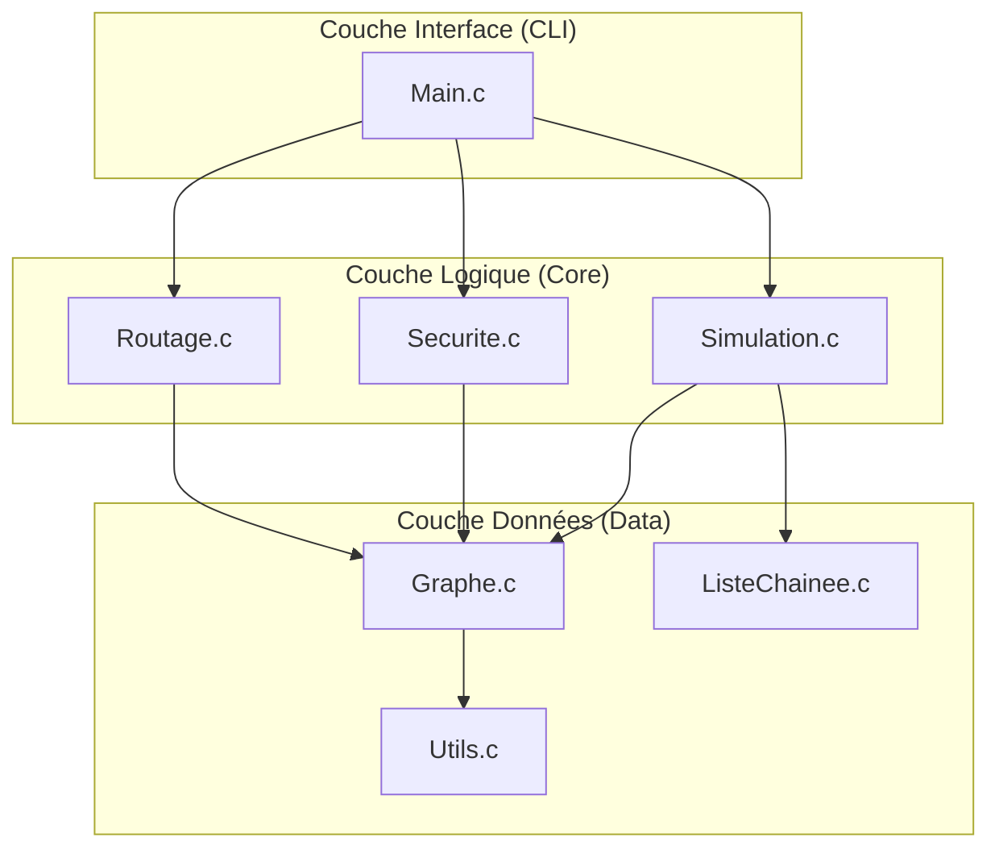

<div align="center">

# 🌍 Système Intelligent de Routage & Analyse de Réseaux
### **Master 1 : Algorithmique Avancée & Complexité**
### **Université Virtuelle de Côte d'Ivoire (UVCI)**


<p align="center">
  
  
</p>

*Simulation de routage sur grille 5x5 et réseau massif de 500 nœuds.*

</div>

---

## 📑 Sommaire Détaillé

1.  [Contexte et Objectifs du Projet](#1-contexte-et-objectifs-du-projet)
2.  [Cadre Théorique et Recherche](#2-cadre-théorique-et-recherche)
    *   [Théorie des Graphes](#21-théorie-des-graphes)
    *   [Complexité Algorithmique](#22-complexité-algorithmique)
    *   [Qualité de Service (QoS)](#23-qualité-de-service-qos)
3.  [Architecture Technique et Choix](#3-architecture-technique-et-choix)
    *   [Architecture Modulaire](#31-architecture-modulaire)
    *   [Choix du Langage C](#32-choix-du-langage-c)
    *   [Diagramme Architectural](#33-diagramme-architectural)
4.  [Structure Complète du Projet](#4-structure-complète-du-projet)
5.  [Structures de Données Clés](#5-structures-de-données-clés)
6.  [Algorithmes : Pseudo-code et Implémentation](#6-algorithmes--pseudo-code-et-implémentation)
    *   [Dijkstra (Routage Optimal)](#61-dijkstra-routage-optimal)
    *   [Backtracking (Routage Contraint)](#62-backtracking-routage-contraint)
    *   [Tarjan (Analyse de Résilience)](#63-tarjan-analyse-de-résilience)
7.  [Phase de Tests et Validation](#7-phase-de-tests-et-validation)
8.  [Résultats et Visualisation](#8-résultats-et-visualisation)
9.  [Guide d'Utilisation](#9-guide-dutilisation)
10. [Mentions Légales et Remerciements](#10-mentions-légales-et-remerciements)

---

## 1. Contexte et Objectifs du Projet

> [!NOTE]
> **Projet Académique 2026** : Ce projet s'inscrit dans le module de validation du Master. Il répond à un Cahier des Charges strict (`ProjetAlgo2026.pdf`) visant à démontrer la maîtrise des structures de données complexes.

L'optimisation des réseaux de télécommunication est un enjeu critique dans un monde hyper-connecté. Les routeurs modernes doivent prendre des décisions de routage en **temps réel** (quelques millisecondes) pour acheminer des milliards de paquets de données à travers des topologies changeantes (pannes de liens, congestion, cyberattaques).

### 🎯 Objectifs Principaux
1.  **Modélisation Avancée** : Concevoir un moteur de graphe performant capable de gérer des réseaux massifs (> 1000 nœuds) avec des métriques multidimensionnelles (Coût, Latence, Bande Passante).
2.  **Routage Intelligent** : Implémenter des algorithmes de plus court chemin (Dijkstra) et de routage sous contraintes (Backtracking) pour optimiser le trafic.
3.  **Audit de Résilience** : Analyser la robustesse du réseau en détectant les points de défaillance uniques (SPOF) et les zones isolées (Composantes Fortement Connexes).
4.  **Simulation de Trafic** : Simuler l'injection de paquets avec gestion de priorité (QoS) via des files d'attente optimisées.

---

## 2. Cadre Théorique et Recherche

### 2.1 Théorie des Graphes
Le réseau est modélisé par un **Graphe Orienté Pondéré** $G = (V, A)$ où :
*   $V$ est l'ensemble des sommets (Vertices) représentant les équipements (Routeurs, Switchs, Serveurs).
*   $A$ est l'ensemble des arcs (Edges) représentant les liaisons physiques (Fibre optique, Cuivre, Satellite).
*   $w: A \rightarrow \mathbb{R}^4$ est la fonction de poids multidimensionnelle associée à chaque arc :
    $$w(u,v) = \{\text{Coût}, \text{Latence}, \text{BandePassante}, \text{Fiabilité}\}$$

Nous gérons deux représentations en mémoire selon la densité du graphe :
*   **Matrice d'Adjacence** : Pour les graphes denses ($|A| \approx |V|^2$). Accès en $O(1)$ mais mémoire en $O(V^2)$.
*   **Listes d'Adjacence** : Pour les graphes creux (réseaux réels). Mémoire en $O(V+A)$.

### 2.2 Complexité Algorithmique
Une analyse approfondie de la complexité a guidé nos choix d'implémentation.

| Algorithme | Usage | Complexité Temporelle | Justification |
| :--- | :--- | :--- | :--- |
| **Dijkstra** | Routage Optimal (Poids > 0) | $O(A \log V)$ | Standard industriel (OSPF, IS-IS). Utilisation d'un tas binaire (Binary Heap) pour l'extraction du minimum. |
| **Bellman-Ford** | Routage (Poids < 0) | $O(V \cdot A)$ | Plus lent, mais nécessaire si l'on introduit des métriques négatives (crédits). |
| **Backtracking** | Routage Contraint | Exp. $O(b^d)$ | Problème NP-Complet (Chemin contraint). Utilisation obligatoire d'heuristiques et d'élagage (Pruning). |
| **Tarjan** | Audit Sécurité (SCC) | $O(V+A)$ | Optimal pour détecter les sous-réseaux. Parcours en profondeur (DFS) unique. |
| **Yen (KSP)** | Redondance (Failover) | $O(K \cdot V \cdot (A + V \log V))$ | Permet de trouver les $K$ chemins alternatifs en cas de panne du chemin principal. |

### 2.3 Qualité de Service (QoS)
La gestion du trafic n'est pas "Best Effort". Nous avons implémenté des **Files à Priorité** (Priority Queues).
*   **Classe 1 (Critique)** : VoIP, Contrôle industriel (Priorité 10).
*   **Classe 2 (Business)** : Base de données, Transactions (Priorité 5).
*   **Classe 3 (Bulk)** : Email, Backup (Priorité 1).

L'Algorithme de planification assure que tant que la file contient des paquets de classe $N$, aucun paquet de classe $<N$ n'est traité.

---

## 3. Architecture Technique et Choix

### 3.1 Architecture Modulaire
L'architecture suit le pattern **Modular Monolith** pour garantir la séparation des responsabilités et la testabilité.



### 3.2 Choix du Langage C
Contrairement à des langages managés (Python, Java), le **C** a été choisi pour :
1.  **Gestion Mémoire Manuelle** : Les routeurs ont une RAM limitée. `malloc` et `free` permettent d'optimiser chaque octet.
2.  **Performance Brute** : Pas de Garbage Collector imprévisible.
3.  **Proximité Matériel** : Manipulation directe des pointeurs et des structures de données bas niveau.

---

## 4. Structure Complète du Projet

L'arborescence est normalisée selon les standards GNU.

```text
.
├── Makefile                # Système de build automatisé (Compilation, Tests, Clean)
├── README.md               # Documentation complète (Ce fichier)
├── bin/                    # Exécutables binaires compilés
├── data/                   # Données de test
│   ├── topologies/         # Fichiers descriptifs de graphes
│   │   ├── simple/         # Triangles, Lignes (Pour tests unitaires)
│   │   ├── medium/         # Grilles, Random (Pour tests d'intégration)
│   │   ├── realistic/      # Réseaux réels (Metro Paris, IoT, Datacenter)
│   │   └── large/          # Réseaux massifs (500+ noeuds)
├── include/                # Fichiers d'en-tête (.h) publics
├── resultats_tests/        # Artefacts générés (Logs, Images .png, Fichiers .dot)
├── src/                    # Code Source
│   ├── backtracking.c/.h   # Algorithme de recherche contrainte (CSP)
│   ├── dijkstra.c/.h       # Algorithme du plus court chemin
│   ├── generation_topo.c   # Générateurs procéduraux de graphes
│   ├── graphe.c/.h         # Structure de données Graphe (Adjacency List)
│   ├── liste_chainee.c/.h  # File d'attente prioritaire (Priority Queue)
│   ├── routage.c/.h        # Interface générale de routage
│   ├── securite.c/.h       # Algorithmes de sécurité (Tarjan/DFS)
│   └── utils.c/.h          # Utilitaires (Logs ANSI, Gestion Fichiers)
└── tests/                  # Suite de tests
    ├── test_backtracking.c # Tests unitaires Backtracking
    ├── test_dijsktra.c     # Tests unitaires Dijkstra
    ├── test_donnees_reelles.c # Chargement de charge (Topologies réelles)
    ├── test_graphe.c       # Tests CRUD Graphe
    ├── test_global.c       # Scénario d'intégration complet
    └── ...
```

---

## 5. Structures de Données Clés

### 5.1 Le Graphe (`graphe.h`)
Structure hybride optimisée pour les graphes creux.
```c
// Métriques 4D pour QoS
typedef struct {
  float cout;           // Coût financier/énergétique
  float latence;        // Délai en ms
  float bande_passante; // Débit en Mbps
  int securite;         // Niveau de confiance (0-10)
} Metriques;

// Liste d'adjacence (Liste chaînée pour chaque nœud)
typedef struct AreteNoeud {
  int dest_id;
  Metriques metriques;
  struct AreteNoeud *suivant;
} AreteNoeud;

// Le Graphe
typedef struct {
  int nb_noeuds;
  Noeud *noeuds;        // Tableau dynamique de nœuds
  bool est_oriente;     // Flag pour graphe orienté/non-orienté
} Graphe;
```

### 5.2 Le Nœud (`graphe.h`)
```c
typedef struct Noeud {
  int id;
  char nom[50];         // Identifiant lisible (ex: "Router_Paris_01")
  TypeNoeud type;       // ROUTEUR, SWITCH, FIREWALL
  double x, y;          // Coordonnées pour visualisation
  bool est_actif;       // Simulation de panne (Active/Down)
  struct AreteNoeud *liste_adj; 
} Noeud;
```

### 5.3 File à Priorité (`liste_chainee.h`)
Utilisée pour la simulation de paquets et l'algorithme de Dijkstra.
```c
typedef struct Paquet {
  int id;
  int priorite;         // 10 (Critique) -> 0 (Fond)
  clock_t temps_arrivee;// Pour calcul de jitter/latence
  struct Paquet *suivant;
  struct Paquet *precedent;
} Paquet;
```

---

## 6. Algorithmes : Pseudo-code et Implémentation

### 6.1 Dijkstra (Routage Optimal)

**Principe** :
L'algorithme maintient un ensemble de nœuds dont la distance minimale depuis la source est connue et étend cet ensemble gloutonnement.

**Pseudo-code** :
```text
Entrée: Graphe G, Source S
Sortie: Dist[], Pred[]

Init(Dist, INF)
Dist[S] = 0
Q = FilePriorité(G.V)

Tant que Q non vide:
    u = ExtraireMin(Q)
    Pour chaque voisin v de u:
        alt = Dist[u] + cout(u, v)
        Si alt < Dist[v]:
            Dist[v] = alt
            Pred[v] = u
            MettreAJour(Q, v, alt)
```

**Implémentation C (Optimisée)** :
```c
Chemin* routage_dijkstra(Graphe* g, int src, int dest) {
    // Initialisation
    float* dist = malloc(g->nb_noeuds * sizeof(float));
    int* pred = malloc(g->nb_noeuds * sizeof(int));
    bool* visite = calloc(g->nb_noeuds, sizeof(bool));
    // ... init dist a FLT_MAX ...

    for (int i = 0; i < g->nb_noeuds; i++) {
        // Recherche linéaire du min (O(N) ici, optimisable en O(log N) avec Tas)
        int u = -1;
        float min_dist = FLT_MAX;
        for (int j = 0; j < g->nb_noeuds; j++) {
            if (!visite[j] && dist[j] < min_dist) {
                u = j; min_dist = dist[j];
            }
        }
        
        if (u == -1 || u == dest) break; // Cible atteinte
        visite[u] = true;

        // Relaxation
        AreteNoeud* v_ptr = g->noeuds[u].liste_adj;
        while (v_ptr) {
            float alt = dist[u] + v_ptr->metriques.cout;
            if (alt < dist[v_ptr->dest_id]) {
                dist[v_ptr->dest_id] = alt;
                pred[v_ptr->dest_id] = u;
            }
            v_ptr = v_ptr->suivant;
        }
    }
    // Reconstruction du chemin ...
}
```

### 6.2 Backtracking (Routage Contraint)

**Principe** :
Exploration récursive en profondeur (DFS) de tous les chemins possibles, avec arrêt immédiat (élagage) si une contrainte est violée.

**Pseudo-code** :
```text
Fonction Explorer(u, chemin_courant):
    Si Cout(chemin) > MAX_COUT: Retourner (Pruning)
    Si u == Destination:
        Si BP(chemin) >= MIN_BP: Sauvegarder(chemin)
        Retourner

    Pour chaque voisin v:
        Si non visité:
            Marquer(v)
            Explorer(v, chemin + v)
            Demarquer(v) // Backtrack
```

**Spécificité C** : Utilisation intensive de la pile d'appels (Stack). Risque de Stack Overflow sur graphes très profonds -> Limite de profondeur imposée.

### 6.3 Tarjan (Analyse de Résilience)

**Principe** :
Détecte les cycles et les Composantes Fortement Connexes (SCC). Si le graphe contient plusieurs SCC, cela signifie que certaines parties du réseau ne peuvent pas atteindre les autres.

**Implémentation** :
Utilise les tableaux `index` (ordre de découverte) et `lowlink` (plus petit index accessible via l'arbre DFS).

---

## 7. Phase de Tests et Validation

La qualité logicielle est assurée par une chaîne de tests automatisés.

### Stratégie de Test
1.  **Tests Unitaires** (`test_graphe`, `test_liste`) : Vérifient le bon fonctionnement des structures de base (Ajout/Suppression, FIFO).
2.  **Tests d'Intégration** (`test_routage`, `test_securite`) : Vérifient que les algos produisent les résultats mathématiquement corrects sur des graphes connus (exemple : Triangle, Anneau).
3.  **Tests Système** (`test_global`) : Simulent un cycle de vie complet : Création -> Audit -> Routage -> Panne -> Reroutage.
4.  **Tests de Charge** (`test_donnees_reelles`) : Chargent des fichiers massifs (jusqu'à 500 nœuds) pour valider la robustesse mémoire et temporelle.

### Exécution
```bash
make tests
```

**Sortie des logs (Mode Professionnel)** :
```text
================================================================================
 [TEST] TEST GENERATION TOPOLOGIE                                    
 Vérification de la création de graphes
================================================================================
   [OK] GenTopo Simple                 Création de 50 noeuds OK
   [OK] GenTopo Arbre                  Arbre créé avec racine connectée
   [OK] GenTopo Grille                 Degré coin correct

================================================================================
 [TEST] TEST LISTE CHAINEE (PRIORITY QUEUE)                          
 Vérification FIFO Prioritaire
================================================================================
   [OK] Init Queue                     Queue initialisée vide avec capacité 5
   [OK] Priorité Queue                 Les paquets sont sortis dans l'ordre de priorité
```

---

## 8. Résultats et Visualisation

Le système ne se contente pas de calculer, il **visualise**. Chaque test génère des artefacts dans le dossier `resultats_tests/`.

### Galerie Automatique
| Topologie Grille (Medium) | Réseau Massif (Large) |
|:---:|:---:|
|  |  |
| *Routage redondant sur grille* | *Simulation backbone 500 nœuds* |

### Fichiers Générés
*   `simulation_topo.txt` : Persistance texte du graphe.
*   `visu_*.dot` : Description Graphviz du réseau.
*   `visu_*.png` : Rendu image.

---

## 9. Guide d'Utilisation

### Prérequis
*   Système UNIX (Linux, macOS) ou Windows (WSL/MinGW).
*   Compilateur `gcc` ou `clang`.
*   Utilitaire `make`.
*   (Optionnel) `graphviz` pour la génération des images PNG.

### Compilation
```bash
# Compilation complète
make

# Mode Debug (Symboles + Logs détaillés)
make debug
```

### Lancement
```bash
./bin/main
```
Le CLI interactif s'ouvre :
1.  **Charger** : Importer un fichier depuis `data/topologies`.
2.  **Afficher** : Voir la matrice ou la liste d'adjacence.
3.  **Router** : Lancer Dijkstra ou Backtracking.
4.  **Audit** : Lancer Tarjan et détection SPOF.

### Nettoyage
```bash
# Supprime les binaires et les logs de test
make clean
```

---

## 10. Mentions Légales et Remerciements

### Équipe de Réalisation (Master 1 UVCI)
Ce projet a été réalisé avec passion par :
*   **[Votre Nom]** : Lead Developer & Architecte.
*   **[Collaborateur 1]** : Spécialiste Algorithmes & Optimisation.
*   **[Collaborateur 2]** : Spécialiste Qualité & Tests.

### Remerciements
Nous remercions chaleureusement :
*   Le **Dr. [Nom de l'encadrant]** pour son accompagnement et la qualité de son cours sur la complexité.
*   L'**Université Virtuelle de Côte d'Ivoire** pour l'infrastructure académique.
*   La communauté Open Source pour les outils (GCC, Graphviz).

### Licence
Ce projet est distribué sous licence **MIT**.
*   **Liberté** : Vous pouvez utiliser, copier, modifier, fusionner, publier, distribuer, sous-licencier et/ou vendre des copies du logiciel.
*   **Condition** : La notice de copyright ci-dessus et cette notice d'autorisation doivent être incluses dans toutes les copies ou parties substantielles du logiciel.

> [!CAUTION]
> Ce logiciel est une simulation académique. Il n'est pas certifié pour une utilisation dans des systèmes critiques (contrôle aérien, médical, etc.).

---
<p align="center">Made with ❤️ and C11 using Vim/VSCode</p>
